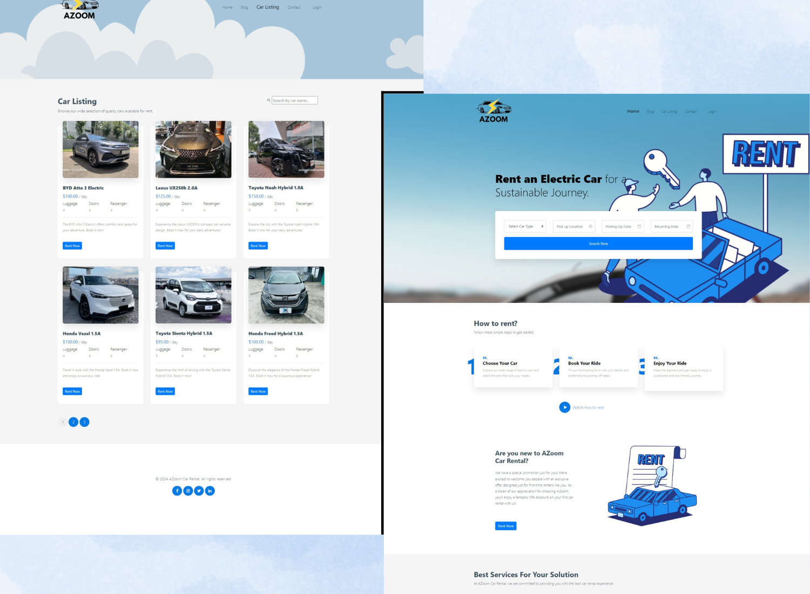

# Assignment 2 | AZoom Car Rental | [Live Site]( https://victorjongsoon.github.io/isit207-azoom/)
AZoom Car Rental is a local car rental company that specializes in renting electric car for the public.

## Screenshots

## Usage
1. HTML
2. CSS
3. JavaScript

## Credits
1. [Sgcarmart](https://www.sgcarmart.com/main/index.php) - Car Images are downloaded from Sgcarmart
2. [Canva](https://www.canva.com/) - Person potraits, Blog images are downloaded from Canva
3. [Bootstrap](https://getbootstrap.com/) - Powerful way to build responsive website
4. Others - If I did not give you credit, do let me know, I'll update according. Thank you to the open source community.

## Author
- LinkedIn - [Victor Jong](https://www.linkedin.com/in/victorjongsoon/)

## Important Notes
- Please do not use any code in this repo
- Finalizing README...
